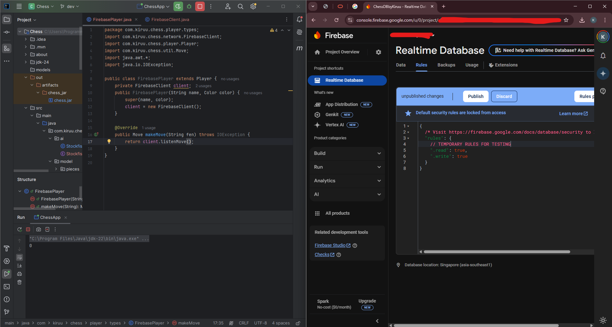

# ♟ Chess Game Project (ONGOING)

## Current Development Progress
### April 19
* Created visual board and move highlighter
* Create the base classes for fundamental game logic
* Added Pawn behavior
### April 20
* Added other pieces' behavior
* Added En Passant and Castling
* Added Promotion logic with GUI
* Added temporary turn-checking failsafes
* Added Check, and Checkmate
* Added temporary Game Over functions
### April 21
* Figured out how to integrate Stockfish
### April 22-23
* Created Stockfish Base Client Class
* Modified the AIPlayer class
### April 24
* Figuring out how to integrate Firebase Realtime Database
## 📌 Overview

This project is a full-featured chess game built in Java using JavaFX. It will include:

- A complete chess engine with all standard rules
- Multiple player types: Human, AI (easy via LLM, hard via trained ML), and Online
- Firebase for online multiplayer and matchmaking
- A modern JavaFX UI with optional 3D board rendering

---

## 📊 Tools & Libraries

- JavaFX (UI and 3D rendering)
- Firebase Realtime Database (Online multiplayer)
- OpenAI API or LLM backend (easy-mode AI)
- TensorFlow Lite / ONNX (hard-mode AI model)
- Gson / Jackson (JSON serialization)

---

## 📈 Future Improvements
- Import/export PGN/FEN files

